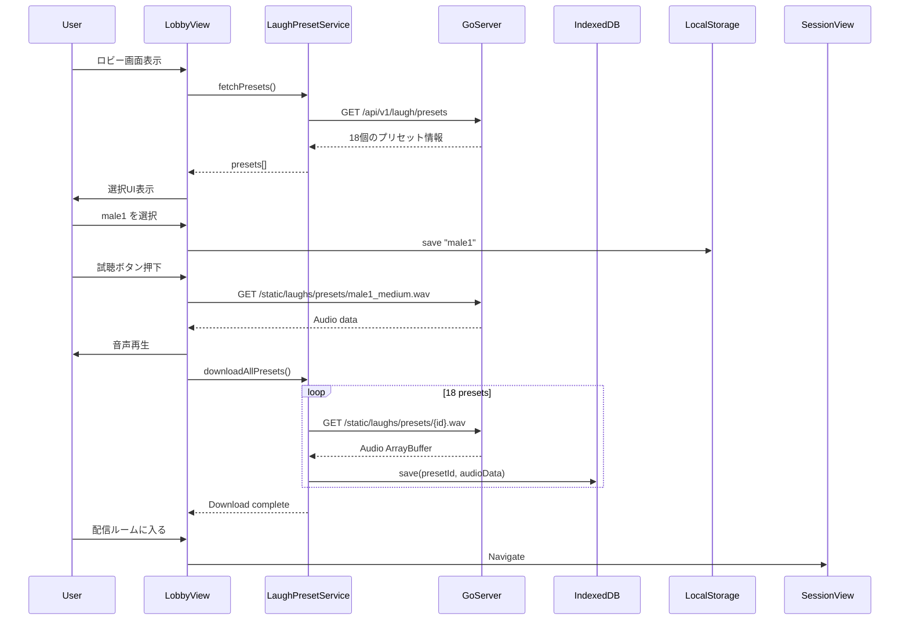
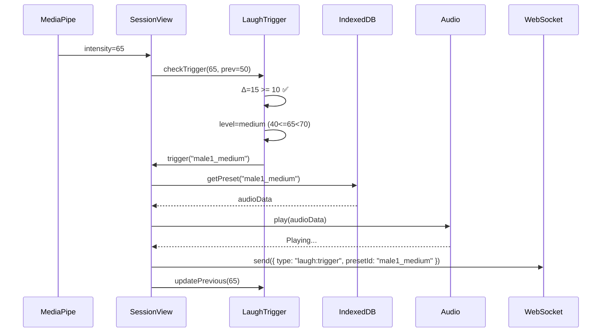
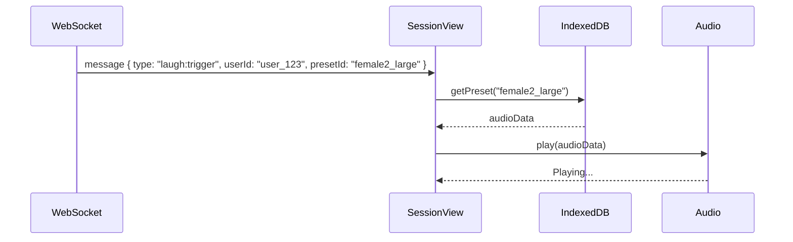

# 笑い声プリセットシステム - 詳細設計書

**作成日**: 2025-10-12
**バージョン**: 1.0
**ステータス**: 設計完了・実装準備中

---

## 📋 目次

1. [概要](#概要)
2. [システムアーキテクチャ](#システムアーキテクチャ)
3. [感情値マッピング仕様](#感情値マッピング仕様)
4. [UI/UX設計](#uiux設計)
5. [データフロー](#データフロー)
6. [技術仕様](#技術仕様)
7. [実装詳細](#実装詳細)
8. [WebSocketプロトコル](#websocketプロトコル)
9. [エラーハンドリング](#エラーハンドリング)
10. [パフォーマンス最適化](#パフォーマンス最適化)
11. [テスト計画](#テスト計画)

---

## 概要

### 目的

視聴者の感情値（intensity）に応じて、ユーザーが選択した笑い声プリセットを自動的に再生することで、「笑いの共有体験」を実現する。

### 主要機能

1. **感情値ベースのトリガー**: Δintensity（変化量）が閾値を超えたときに笑い声を再生
2. **プリセット選択**: 6種類の笑い声パターンからユーザーが選択
3. **レベル自動判定**: 感情値の強さに応じて small/medium/large を自動選択
4. **全員共有**: 配信者・視聴者全員が全員の笑い声を聞く

### 主要な技術スタック

- **フロントエンド**: React + TypeScript + IndexedDB
- **バックエンド**: Go Signaling Server (既存)
- **通信**: WebSocket (既存インフラ活用)
- **ストレージ**: IndexedDB (ブラウザローカル)

---

## システムアーキテクチャ

### 全体構成図

```
┌─────────────────────────────────────────────────────────┐
│                    Lobby Screen                         │
│  ┌──────────────────────────────────────────────────┐  │
│  │  Laugh Preset Selector (Avatar Grid)             │  │
│  │  😄 Male1  😆 Male2  🤣 Male3                    │  │
│  │  😊 Female1 😁 Female2 😂 Female3                │  │
│  └──────────────────────────────────────────────────┘  │
│             ↓ User selects pattern                      │
│  [Save to LocalStorage: laughPattern="male1"]           │
│             ↓                                            │
│  [Download all 18 presets to IndexedDB]                 │
└─────────────────────────────────────────────────────────┘
                          ↓
┌─────────────────────────────────────────────────────────┐
│                  Session Screen (配信画面)              │
│  ┌─────────────────────────────────────────────────┐   │
│  │  MediaPipe Face Detection                       │   │
│  │      ↓                                          │   │
│  │  Emotion Intensity Calculation                  │   │
│  │      ↓                                          │   │
│  │  Laugh Trigger Logic                           │   │
│  │   (Δintensity >= 10)                           │   │
│  │      ↓                                          │   │
│  │  Level Determination (small/medium/large)       │   │
│  │      ↓                                          │   │
│  │  Play Audio from IndexedDB                     │   │
│  │      +                                          │   │
│  │  Send WebSocket Message                        │   │
│  └─────────────────────────────────────────────────┘   │
│                                                         │
│  ┌─────────────────────────────────────────────────┐   │
│  │  WebSocket Message Handler                      │   │
│  │      ↓                                          │   │
│  │  Receive Other User's Laugh                    │   │
│  │      ↓                                          │   │
│  │  Fetch Audio from IndexedDB                    │   │
│  │      ↓                                          │   │
│  │  Play Audio                                    │   │
│  └─────────────────────────────────────────────────┘   │
└─────────────────────────────────────────────────────────┘
```

### レイヤー構成

```
┌─────────────────────────────────────┐
│  Presentation Layer                 │
│  - LobbyView (笑い声選択UI)         │
│  - SessionView (配信画面)            │
└─────────────────────────────────────┘
              ↓
┌─────────────────────────────────────┐
│  Application Logic Layer            │
│  - useLaughPresets (Hook)           │
│  - useLaughPlayer (Hook)            │
│  - LaughTriggerLogic                │
└─────────────────────────────────────┘
              ↓
┌─────────────────────────────────────┐
│  Data Access Layer                  │
│  - LaughPresetService               │
│  - IndexedDBManager                 │
│  - WebSocketClient (既存)            │
└─────────────────────────────────────┘
              ↓
┌─────────────────────────────────────┐
│  Storage / Communication            │
│  - IndexedDB (Browser)              │
│  - WebSocket (Go Signaling Server)  │
│  - LocalStorage (Settings)          │
└─────────────────────────────────────┘
```

---

## 感情値マッピング仕様

### Intensity → Level マッピング

| Intensity範囲 | レベル | 説明 | 動作 |
|--------------|--------|------|------|
| 0 - 19 | `null` (無音) | 笑っているが声は出ない状態 | 音声再生なし |
| 20 - 39 | `small` | 小笑い | `{pattern}_small.wav` 再生 |
| 40 - 69 | `medium` | 中笑い | `{pattern}_medium.wav` 再生 |
| 70 - 100 | `large` | 大笑い | `{pattern}_large.wav` 再生 |

**境界値の扱い:**
```typescript
if (intensity < 20) → null (無音)
else if (intensity < 40) → small
else if (intensity < 70) → medium
else → large
```

### トリガー条件

笑い声を再生するかどうかは、**Δintensity（変化量）**で判定する。

```typescript
Δintensity = currentIntensity - previousIntensity

if (Δintensity >= 10) {
  // 笑い声をトリガー
  playLaugh(currentIntensity);
} else {
  // じんわり笑い（無音）
}
```

**理由:**
- 急激に笑った場合のみ声を出す → 自然な笑い声
- じわじわ笑う場合は声にならない → スパム防止

### 具体的なシナリオ

#### シナリオ1: 急激に笑う（声が出る）

```
t=0: intensity=15, previousIntensity=0
  → Δ=15 >= 10 ✅
  → レベル判定: 15 < 20 → 無音
  → 再生しない

t=1: intensity=35, previousIntensity=15
  → Δ=20 >= 10 ✅
  → レベル判定: 20 <= 35 < 40 → small
  → male1_small.wav 再生 🔊
```

#### シナリオ2: じわじわ笑う（声は出ない）

```
t=0: intensity=15, previousIntensity=0
  → Δ=15 >= 10 ✅
  → レベル判定: 15 < 20 → 無音
  → 再生しない

t=1: intensity=22, previousIntensity=15
  → Δ=7 < 10 ❌
  → 再生しない

t=2: intensity=28, previousIntensity=22
  → Δ=6 < 10 ❌
  → 再生しない
```

#### シナリオ3: 大爆笑

```
t=0: intensity=30, previousIntensity=0
  → Δ=30 >= 10 ✅
  → レベル判定: 20 <= 30 < 40 → small
  → male1_small.wav 再生 🔊

t=1: intensity=85, previousIntensity=30
  → Δ=55 >= 10 ✅
  → レベル判定: 85 >= 70 → large
  → male1_large.wav 再生 🔊🔊
```

#### シナリオ4: 継続的に笑っている（トリガーしない）

```
t=0: intensity=60, previousIntensity=0
  → Δ=60 >= 10 ✅
  → レベル判定: 40 <= 60 < 70 → medium
  → male1_medium.wav 再生 🔊

t=1: intensity=65, previousIntensity=60
  → Δ=5 < 10 ❌
  → 再生しない（継続笑いはスパム防止）

t=2: intensity=68, previousIntensity=65
  → Δ=3 < 10 ❌
  → 再生しない
```

### previousIntensity の初期値

```typescript
// 初期値は 0 とする
const [previousIntensity, setPreviousIntensity] = useState<number>(0);

// 初回フレーム
t=0: intensity=50, previousIntensity=0
  → Δ=50 >= 10 ✅
  → トリガー発火
```

---

## UI/UX設計

### ロビー画面 - 笑い声選択UI

#### レイアウト

```
┌────────────────────────────────────────────────────────┐
│                   lolup Live                           │
│                                                        │
│        あなたの笑い声を選んでください 😄               │
│                                                        │
│  ┌──────────┐  ┌──────────┐  ┌──────────┐           │
│  │   😄     │  │   😆     │  │   🤣     │           │
│  │  男性1   │  │  男性2   │  │  男性3   │           │
│  │          │  │          │  │          │           │
│  │ [▶️ 試聴] │  │ [▶️ 試聴] │  │ [▶️ 試聴] │           │
│  └──────────┘  └──────────┘  └──────────┘           │
│       ↑ 選択中（ハイライト）                           │
│                                                        │
│  ┌──────────┐  ┌──────────┐  ┌──────────┐           │
│  │   😊     │  │   😁     │  │   😂     │           │
│  │  女性1   │  │  女性2   │  │  女性3   │           │
│  │          │  │          │  │          │           │
│  │ [▶️ 試聴] │  │ [▶️ 試聴] │  │ [▶️ 試聴] │           │
│  └──────────┘  └──────────┘  └──────────┘           │
│                                                        │
│  [ プリセットをダウンロード中... 12/18 ]               │
│                                                        │
│  ┌────────────────────────────────────────┐           │
│  │      配信ルームに入る                   │           │
│  └────────────────────────────────────────┘           │
│                                                        │
└────────────────────────────────────────────────────────┘
```

#### インタラクション

1. **選択**: カードをクリックで選択（ハイライト表示）
2. **試聴**: 各カードの「▶️ 試聴」ボタンで medium（中笑い）を再生
3. **ダウンロード進行状況**: プリセットダウンロード中はプログレスバー表示
4. **入室**: 「配信ルームに入る」ボタンで配信画面へ遷移

#### 状態管理

```typescript
interface LobbyState {
  selectedPattern: string;           // "male1"
  presets: LaughPreset[];            // 全18プリセット
  downloadProgress: number;          // 0-18
  isDownloading: boolean;
  downloadError: string | null;
}
```

### 配信画面 - 笑い声再生（UI変更なし）

配信画面では**UI変更なし**。バックグラウンドで笑い声が再生される。

**表示例（デバッグ用・本番では非表示可）:**

```
┌─────────────────────────────┐
│  🎥 配信中                  │
│                             │
│  [あなた]                   │
│  笑い強度: 65 (medium)      │
│  📢 ハハハ... (再生中)      │
│                             │
│  [視聴者A - female2]        │
│  📢 アハハハ... (再生中)    │
│                             │
└─────────────────────────────┘
```

---

## データフロー

### 1. ロビー画面でのプリセット準備



### 2. 配信画面での笑い声トリガー（自分）



### 3. 配信画面での笑い声受信（他ユーザー）



---

## 技術仕様

### プリセット情報

#### パターン（6種類）

| Pattern ID | 表示名 | 説明 |
|-----------|--------|------|
| `male1` | 男性1 | 明るい男性の笑い声 |
| `male2` | 男性2 | 落ち着いた男性の笑い声 |
| `male3` | 男性3 | 豪快な男性の笑い声 |
| `female1` | 女性1 | 明るい女性の笑い声 |
| `female2` | 女性2 | 上品な女性の笑い声 |
| `female3` | 女性3 | 元気な女性の笑い声 |

#### レベル（3種類）

| Level | ファイルサフィックス | 説明 |
|-------|---------------------|------|
| `small` | `_small.wav` | 小笑い（intensity 20-39） |
| `medium` | `_medium.wav` | 中笑い（intensity 40-69） |
| `large` | `_large.wav` | 大笑い（intensity 70-100） |

#### プリセットID命名規則

```
{pattern}_{level}

例:
- male1_small
- male1_medium
- male1_large
- female2_small
- female2_medium
- female2_large
```

**合計: 6パターン × 3レベル = 18プリセット**

### API仕様（バックエンド）

#### 1. プリセット一覧取得

```http
GET /api/v1/laugh/presets
```

**レスポンス:**
```json
{
  "presets": [
    {
      "id": "male1_small",
      "pattern": "male1",
      "level": "small",
      "url": "/static/laughs/presets/male1_small.wav",
      "duration": 1.2,
      "size": 114688
    },
    ...
  ]
}
```

#### 2. プリセット音声ファイル取得

```http
GET /static/laughs/presets/{presetId}.wav
```

**レスポンス:**
- Content-Type: `audio/wav`
- Body: WAVファイルのバイナリデータ

### IndexedDB スキーマ

#### データベース情報

```typescript
const DB_NAME = 'LolupLiveDB';
const DB_VERSION = 1;
const STORE_NAME = 'laughPresets';
```

#### Object Store スキーマ

```typescript
interface LaughPresetDB {
  id: string;              // Primary Key: "male1_small"
  pattern: string;         // "male1"
  level: string;           // "small" | "medium" | "large"
  duration: number;        // 1.2 (秒)
  size: number;            // 114688 (バイト)
  audioData: ArrayBuffer;  // WAVファイルのバイナリデータ
  downloadedAt: number;    // Unix timestamp
}
```

#### インデックス

```typescript
objectStore.createIndex('pattern', 'pattern', { unique: false });
objectStore.createIndex('level', 'level', { unique: false });
```

### LocalStorage スキーマ

```typescript
interface LaughSettings {
  selectedPattern: string;  // "male1"
  version: string;          // "1.0"
  updatedAt: number;        // Unix timestamp
}

// Key: "lolup_laugh_settings"
localStorage.setItem('lolup_laugh_settings', JSON.stringify(settings));
```

---

## 実装詳細

### ディレクトリ構造

```
src/
├── services/
│   └── laugh/
│       ├── LaughPresetService.ts      # プリセット管理サービス
│       ├── IndexedDBManager.ts        # IndexedDB操作
│       └── LaughPlayer.ts             # 音声再生ロジック
├── hooks/
│   ├── useLaughPresets.ts             # プリセット取得Hook
│   └── useLaughPlayer.ts              # 笑い声再生Hook
├── components/
│   ├── lobby/
│   │   └── LaughPresetSelector.tsx   # 笑い声選択UI
│   └── session/
│       └── SessionView.tsx            # 配信画面（既存に追加）
└── types/
    └── laugh.ts                       # 型定義
```

### 型定義 (types/laugh.ts)

```typescript
// プリセット情報（API取得用）
export interface LaughPreset {
  id: string;           // "male1_small"
  pattern: string;      // "male1"
  level: string;        // "small" | "medium" | "large"
  url: string;          // "/static/laughs/presets/male1_small.wav"
  duration: number;     // 1.2
  size: number;         // 114688
}

// プリセット一覧APIレスポンス
export interface PresetsResponse {
  presets: LaughPreset[];
}

// IndexedDB保存用
export interface LaughPresetDB {
  id: string;
  pattern: string;
  level: string;
  duration: number;
  size: number;
  audioData: ArrayBuffer;
  downloadedAt: number;
}

// LocalStorage保存用
export interface LaughSettings {
  selectedPattern: string;
  version: string;
  updatedAt: number;
}

// 笑い声レベル
export type LaughLevel = 'small' | 'medium' | 'large';

// 笑い声トリガー結果
export interface LaughTriggerResult {
  shouldTrigger: boolean;
  level: LaughLevel | null;
  presetId: string | null;  // "male1_medium"
}
```

### IndexedDBManager (services/laugh/IndexedDBManager.ts)

```typescript
const DB_NAME = 'LolupLiveDB';
const DB_VERSION = 1;
const STORE_NAME = 'laughPresets';

export class IndexedDBManager {
  private db: IDBDatabase | null = null;

  /**
   * データベースを開く
   */
  async open(): Promise<IDBDatabase> {
    if (this.db) return this.db;

    return new Promise((resolve, reject) => {
      const request = indexedDB.open(DB_NAME, DB_VERSION);

      request.onerror = () => reject(request.error);
      request.onsuccess = () => {
        this.db = request.result;
        resolve(request.result);
      };

      request.onupgradeneeded = (event) => {
        const db = (event.target as IDBOpenDBRequest).result;

        // Object Storeを作成
        if (!db.objectStoreNames.contains(STORE_NAME)) {
          const objectStore = db.createObjectStore(STORE_NAME, { keyPath: 'id' });
          objectStore.createIndex('pattern', 'pattern', { unique: false });
          objectStore.createIndex('level', 'level', { unique: false });
        }
      };
    });
  }

  /**
   * プリセットを保存
   */
  async savePreset(preset: LaughPresetDB): Promise<void> {
    const db = await this.open();
    const transaction = db.transaction([STORE_NAME], 'readwrite');
    const store = transaction.objectStore(STORE_NAME);

    return new Promise((resolve, reject) => {
      const request = store.put(preset);
      request.onsuccess = () => resolve();
      request.onerror = () => reject(request.error);
    });
  }

  /**
   * プリセットを取得
   */
  async getPreset(presetId: string): Promise<LaughPresetDB | null> {
    const db = await this.open();
    const transaction = db.transaction([STORE_NAME], 'readonly');
    const store = transaction.objectStore(STORE_NAME);

    return new Promise((resolve, reject) => {
      const request = store.get(presetId);
      request.onsuccess = () => resolve(request.result || null);
      request.onerror = () => reject(request.error);
    });
  }

  /**
   * 全プリセットを取得
   */
  async getAllPresets(): Promise<LaughPresetDB[]> {
    const db = await this.open();
    const transaction = db.transaction([STORE_NAME], 'readonly');
    const store = transaction.objectStore(STORE_NAME);

    return new Promise((resolve, reject) => {
      const request = store.getAll();
      request.onsuccess = () => resolve(request.result);
      request.onerror = () => reject(request.error);
    });
  }

  /**
   * プリセットを削除
   */
  async deletePreset(presetId: string): Promise<void> {
    const db = await this.open();
    const transaction = db.transaction([STORE_NAME], 'readwrite');
    const store = transaction.objectStore(STORE_NAME);

    return new Promise((resolve, reject) => {
      const request = store.delete(presetId);
      request.onsuccess = () => resolve();
      request.onerror = () => reject(request.error);
    });
  }

  /**
   * 全プリセットを削除
   */
  async clearAll(): Promise<void> {
    const db = await this.open();
    const transaction = db.transaction([STORE_NAME], 'readwrite');
    const store = transaction.objectStore(STORE_NAME);

    return new Promise((resolve, reject) => {
      const request = store.clear();
      request.onsuccess = () => resolve();
      request.onerror = () => reject(request.error);
    });
  }
}
```

### LaughPresetService (services/laugh/LaughPresetService.ts)

```typescript
import { IndexedDBManager } from './IndexedDBManager';
import type { LaughPreset, PresetsResponse, LaughPresetDB } from '../../types/laugh';

const LAUGH_API_URL = import.meta.env.VITE_LAUGH_API_URL || 'http://localhost:5001';
const STATIC_BASE_URL = import.meta.env.VITE_STATIC_BASE_URL || 'http://localhost:8080';

export class LaughPresetService {
  private dbManager: IndexedDBManager;

  constructor() {
    this.dbManager = new IndexedDBManager();
  }

  /**
   * プリセット一覧を取得（APIから）
   */
  async fetchPresets(): Promise<LaughPreset[]> {
    try {
      const response = await fetch(`${LAUGH_API_URL}/api/v1/laugh/presets`);
      if (!response.ok) {
        throw new Error(`HTTP error! status: ${response.status}`);
      }
      const data: PresetsResponse = await response.json();
      return data.presets;
    } catch (error) {
      console.error('Failed to fetch presets:', error);
      throw error;
    }
  }

  /**
   * プリセット音声ファイルをダウンロード
   */
  async downloadPresetAudio(url: string): Promise<ArrayBuffer> {
    try {
      const fullUrl = `${STATIC_BASE_URL}${url}`;
      const response = await fetch(fullUrl);

      if (!response.ok) {
        throw new Error(`HTTP error! status: ${response.status}`);
      }

      return await response.arrayBuffer();
    } catch (error) {
      console.error('Failed to download audio:', error);
      throw error;
    }
  }

  /**
   * プリセットをIndexedDBに保存
   */
  async savePreset(preset: LaughPreset, audioData: ArrayBuffer): Promise<void> {
    const data: LaughPresetDB = {
      id: preset.id,
      pattern: preset.pattern,
      level: preset.level,
      duration: preset.duration,
      size: preset.size,
      audioData: audioData,
      downloadedAt: Date.now()
    };

    await this.dbManager.savePreset(data);
  }

  /**
   * 全プリセットをダウンロードして保存
   */
  async downloadAllPresets(
    presets: LaughPreset[],
    onProgress?: (current: number, total: number) => void
  ): Promise<void> {
    const total = presets.length;

    for (let i = 0; i < total; i++) {
      const preset = presets[i];
      try {
        // ダウンロード
        const audioData = await this.downloadPresetAudio(preset.url);

        // IndexedDBに保存
        await this.savePreset(preset, audioData);

        // 進行状況を通知
        onProgress?.(i + 1, total);

        console.log(`Downloaded: ${preset.id} (${i + 1}/${total})`);
      } catch (error) {
        console.error(`Failed to download ${preset.id}:`, error);
        // エラーでも継続（次のプリセットをダウンロード）
      }
    }
  }

  /**
   * IndexedDBからプリセットを取得
   */
  async getPreset(presetId: string): Promise<LaughPresetDB | null> {
    return await this.dbManager.getPreset(presetId);
  }

  /**
   * キャッシュされた全プリセットを取得
   */
  async getAllCachedPresets(): Promise<LaughPresetDB[]> {
    return await this.dbManager.getAllPresets();
  }
}
```

### LaughPlayer (services/laugh/LaughPlayer.ts)

```typescript
import { LaughPresetService } from './LaughPresetService';
import type { LaughLevel, LaughTriggerResult } from '../../types/laugh';

export class LaughPlayer {
  private presetService: LaughPresetService;
  private previousIntensity: number = 0;

  constructor() {
    this.presetService = new LaughPresetService();
  }

  /**
   * トリガー判定とレベル決定
   */
  checkTrigger(currentIntensity: number): LaughTriggerResult {
    const delta = currentIntensity - this.previousIntensity;

    // トリガー判定
    if (delta < 10) {
      this.previousIntensity = currentIntensity;
      return {
        shouldTrigger: false,
        level: null,
        presetId: null
      };
    }

    // レベル判定
    let level: LaughLevel | null = null;

    if (currentIntensity < 20) {
      level = null; // 無音
    } else if (currentIntensity < 40) {
      level = 'small';
    } else if (currentIntensity < 70) {
      level = 'medium';
    } else {
      level = 'large';
    }

    this.previousIntensity = currentIntensity;

    return {
      shouldTrigger: level !== null,
      level,
      presetId: null // 後でpatternと組み合わせる
    };
  }

  /**
   * 音声を再生（ArrayBufferから）
   */
  async playAudioFromBuffer(audioData: ArrayBuffer): Promise<void> {
    try {
      const blob = new Blob([audioData], { type: 'audio/wav' });
      const url = URL.createObjectURL(blob);

      const audio = new Audio(url);
      await audio.play();

      // 再生終了後にURLを解放
      audio.onended = () => {
        URL.revokeObjectURL(url);
      };
    } catch (error) {
      console.error('Failed to play audio:', error);
      throw error;
    }
  }

  /**
   * プリセットIDで音声を再生
   */
  async playPreset(presetId: string): Promise<void> {
    try {
      // IndexedDBから取得
      const preset = await this.presetService.getPreset(presetId);

      if (!preset) {
        throw new Error(`Preset not found: ${presetId}`);
      }

      // 再生
      await this.playAudioFromBuffer(preset.audioData);
    } catch (error) {
      console.error(`Failed to play preset ${presetId}:`, error);
      throw error;
    }
  }

  /**
   * previousIntensityをリセット
   */
  resetIntensity(): void {
    this.previousIntensity = 0;
  }

  /**
   * previousIntensityを取得
   */
  getPreviousIntensity(): number {
    return this.previousIntensity;
  }
}
```

### useLaughPresets Hook (hooks/useLaughPresets.ts)

```typescript
import { useState, useEffect, useCallback } from 'react';
import { LaughPresetService } from '../services/laugh/LaughPresetService';
import type { LaughPreset } from '../types/laugh';

export const useLaughPresets = () => {
  const [presets, setPresets] = useState<LaughPreset[]>([]);
  const [loading, setLoading] = useState(true);
  const [error, setError] = useState<Error | null>(null);
  const [downloadProgress, setDownloadProgress] = useState<number>(0);
  const [isDownloading, setIsDownloading] = useState(false);

  const presetService = new LaughPresetService();

  // プリセット一覧を取得
  useEffect(() => {
    const loadPresets = async () => {
      try {
        setLoading(true);
        const fetchedPresets = await presetService.fetchPresets();
        setPresets(fetchedPresets);
      } catch (err) {
        setError(err as Error);
      } finally {
        setLoading(false);
      }
    };

    loadPresets();
  }, []);

  // 全プリセットをダウンロード
  const downloadAllPresets = useCallback(async () => {
    try {
      setIsDownloading(true);
      setDownloadProgress(0);

      await presetService.downloadAllPresets(presets, (current, total) => {
        setDownloadProgress(current);
      });

      console.log('All presets downloaded successfully');
    } catch (err) {
      console.error('Failed to download presets:', err);
      throw err;
    } finally {
      setIsDownloading(false);
    }
  }, [presets]);

  return {
    presets,
    loading,
    error,
    downloadProgress,
    isDownloading,
    downloadAllPresets
  };
};
```

### useLaughPlayer Hook (hooks/useLaughPlayer.ts)

```typescript
import { useCallback, useRef } from 'react';
import { LaughPlayer } from '../services/laugh/LaughPlayer';
import type { LaughLevel } from '../types/laugh';

interface UseLaughPlayerOptions {
  selectedPattern: string;  // "male1"
  onLaughTriggered?: (presetId: string, level: LaughLevel) => void;
}

export const useLaughPlayer = (options: UseLaughPlayerOptions) => {
  const { selectedPattern, onLaughTriggered } = options;
  const playerRef = useRef<LaughPlayer>(new LaughPlayer());

  /**
   * 感情値を処理してトリガー判定
   */
  const processIntensity = useCallback(async (intensity: number) => {
    const player = playerRef.current;
    const result = player.checkTrigger(intensity);

    if (result.shouldTrigger && result.level) {
      const presetId = `${selectedPattern}_${result.level}`;

      try {
        // 音声再生
        await player.playPreset(presetId);

        // コールバック
        onLaughTriggered?.(presetId, result.level);
      } catch (error) {
        console.error('Failed to play laugh:', error);
      }
    }
  }, [selectedPattern, onLaughTriggered]);

  /**
   * プリセットIDで直接再生（他ユーザーの笑い声受信時）
   */
  const playPreset = useCallback(async (presetId: string) => {
    try {
      await playerRef.current.playPreset(presetId);
    } catch (error) {
      console.error(`Failed to play preset ${presetId}:`, error);
    }
  }, []);

  /**
   * previousIntensityをリセット
   */
  const resetIntensity = useCallback(() => {
    playerRef.current.resetIntensity();
  }, []);

  return {
    processIntensity,
    playPreset,
    resetIntensity
  };
};
```

### LaughPresetSelector Component (components/lobby/LaughPresetSelector.tsx)

```typescript
import React, { useState, useEffect } from 'react';
import { useLaughPresets } from '../../hooks/useLaughPresets';
import { LaughPlayer } from '../../services/laugh/LaughPlayer';

const PATTERNS = [
  { id: 'male1', label: '男性1', emoji: '😄' },
  { id: 'male2', label: '男性2', emoji: '😆' },
  { id: 'male3', label: '男性3', emoji: '🤣' },
  { id: 'female1', label: '女性1', emoji: '😊' },
  { id: 'female2', label: '女性2', emoji: '😁' },
  { id: 'female3', label: '女性3', emoji: '😂' }
];

export const LaughPresetSelector: React.FC = () => {
  const { presets, loading, downloadProgress, isDownloading, downloadAllPresets } = useLaughPresets();
  const [selectedPattern, setSelectedPattern] = useState<string>('male1');
  const [isPlaying, setIsPlaying] = useState<string | null>(null);
  const laughPlayer = new LaughPlayer();

  // 初回マウント時: 全プリセットをダウンロード
  useEffect(() => {
    if (presets.length > 0 && !isDownloading) {
      downloadAllPresets().catch(err => {
        console.error('Failed to download presets:', err);
      });
    }
  }, [presets, isDownloading, downloadAllPresets]);

  // パターン選択
  const handleSelectPattern = (patternId: string) => {
    setSelectedPattern(patternId);
    // LocalStorageに保存
    localStorage.setItem('lolup_laugh_settings', JSON.stringify({
      selectedPattern: patternId,
      version: '1.0',
      updatedAt: Date.now()
    }));
  };

  // 試聴（medium を再生）
  const handlePreview = async (patternId: string) => {
    const presetId = `${patternId}_medium`;
    setIsPlaying(presetId);

    try {
      await laughPlayer.playPreset(presetId);
    } catch (error) {
      console.error('Failed to preview:', error);
    } finally {
      setIsPlaying(null);
    }
  };

  if (loading) {
    return <div>プリセット情報を読み込んでいます...</div>;
  }

  return (
    <div className="laugh-preset-selector">
      <h2>あなたの笑い声を選んでください 😄</h2>

      <div className="pattern-grid">
        {PATTERNS.map(pattern => (
          <div
            key={pattern.id}
            className={`pattern-card ${selectedPattern === pattern.id ? 'selected' : ''}`}
            onClick={() => handleSelectPattern(pattern.id)}
          >
            <div className="emoji">{pattern.emoji}</div>
            <div className="label">{pattern.label}</div>
            <button
              className="preview-btn"
              onClick={(e) => {
                e.stopPropagation();
                handlePreview(pattern.id);
              }}
              disabled={isPlaying === `${pattern.id}_medium`}
            >
              {isPlaying === `${pattern.id}_medium` ? '再生中...' : '▶️ 試聴'}
            </button>
          </div>
        ))}
      </div>

      {isDownloading && (
        <div className="download-progress">
          プリセットをダウンロード中... {downloadProgress}/{presets.length}
        </div>
      )}

      <button
        className="enter-room-btn"
        disabled={isDownloading}
      >
        配信ルームに入る
      </button>
    </div>
  );
};
```

### SessionView 統合 (components/session/SessionView.tsx)

```typescript
import { useLaughPlayer } from '../../hooks/useLaughPlayer';
import { useWebSocket } from '../../hooks/useWebSocket';

// 既存のSessionViewコンポーネントに追加

export const SessionView: React.FC = () => {
  // ... 既存のコード ...

  // LocalStorageから選択パターンを取得
  const [selectedPattern, setSelectedPattern] = useState<string>(() => {
    const settings = localStorage.getItem('lolup_laugh_settings');
    if (settings) {
      const parsed = JSON.parse(settings);
      return parsed.selectedPattern || 'male1';
    }
    return 'male1';
  });

  // 笑い声プレイヤー
  const { processIntensity, playPreset } = useLaughPlayer({
    selectedPattern,
    onLaughTriggered: (presetId, level) => {
      console.log(`Laugh triggered: ${presetId} (${level})`);

      // WebSocketでブロードキャスト
      if (ws) {
        ws.send(JSON.stringify({
          type: 'laugh:trigger',
          data: {
            presetId,
            timestamp: Date.now()
          },
          timestamp: Date.now()
        }));
      }
    }
  });

  // 感情値更新時に笑い声トリガーをチェック
  useEffect(() => {
    if (!isBroadcaster && receivedEmotions) {
      const myEmotions = receivedEmotions.get(userName);
      if (myEmotions && myEmotions.length > 0) {
        const latestEmotion = myEmotions[myEmotions.length - 1];
        const intensity = latestEmotion.intensity;

        // 笑い声トリガー判定
        processIntensity(intensity);
      }
    }
  }, [receivedEmotions, userName, isBroadcaster, processIntensity]);

  // WebSocketメッセージ受信: 他ユーザーの笑い声
  useEffect(() => {
    if (!ws) return;

    const handleMessage = (event: MessageEvent) => {
      const message = JSON.parse(event.data);

      if (message.type === 'laugh:trigger') {
        const { presetId } = message.data;
        console.log(`Other user laughed: ${presetId}`);
        playPreset(presetId);
      }
    };

    ws.addEventListener('message', handleMessage);

    return () => {
      ws.removeEventListener('message', handleMessage);
    };
  }, [ws, playPreset]);

  // ... 既存のコード ...
};
```

---

## WebSocketプロトコル

### 笑い声トリガーメッセージ（送信）

```typescript
{
  type: 'laugh:trigger',
  data: {
    presetId: string;      // "male1_medium"
    timestamp: number;     // Date.now()
  },
  timestamp: number;
}
```

### 笑い声トリガーメッセージ（受信・ブロードキャスト）

```typescript
{
  type: 'laugh:trigger',
  userId: string;          // "user_123"
  data: {
    presetId: string;      // "female2_large"
    timestamp: number;
  },
  timestamp: number;
}
```

### Go Signaling Server側の実装（参考）

```go
// メッセージタイプ
const (
    MessageTypeLaughTrigger = "laugh:trigger"
)

// LaughTriggerMessage
type LaughTriggerMessage struct {
    Type      string                 `json:"type"`
    UserID    string                 `json:"userId,omitempty"`
    Data      LaughTriggerData       `json:"data"`
    Timestamp int64                  `json:"timestamp"`
}

type LaughTriggerData struct {
    PresetID  string `json:"presetId"`
    Timestamp int64  `json:"timestamp"`
}

// ハンドラー
func handleLaughTrigger(client *Client, message []byte) {
    var msg LaughTriggerMessage
    if err := json.Unmarshal(message, &msg); err != nil {
        return
    }

    // ルーム内の他のユーザーにブロードキャスト
    msg.UserID = client.UserID
    broadcastToRoom(client.RoomID, msg, client.ID)
}
```

---

## エラーハンドリング

### プリセット取得失敗

```typescript
try {
  const presets = await presetService.fetchPresets();
} catch (error) {
  // フォールバック: ハードコードされたプリセット情報を使用
  const fallbackPresets = [
    { id: 'male1_small', pattern: 'male1', level: 'small', url: '/static/laughs/presets/male1_small.wav', duration: 1.2, size: 114688 },
    // ... 残り17個
  ];
  setPresets(fallbackPresets);
}
```

### ダウンロード失敗

```typescript
try {
  await presetService.downloadAllPresets(presets);
} catch (error) {
  // リトライロジック（最大3回）
  for (let i = 0; i < 3; i++) {
    try {
      await presetService.downloadAllPresets(presets);
      break; // 成功したらループ終了
    } catch (retryError) {
      if (i === 2) {
        // 3回失敗したらユーザーに通知
        alert('プリセットのダウンロードに失敗しました。ネットワーク接続を確認してください。');
      }
    }
  }
}
```

### IndexedDB保存失敗

```typescript
try {
  await dbManager.savePreset(preset);
} catch (error) {
  if (error.name === 'QuotaExceededError') {
    // ストレージ容量不足
    alert('ブラウザのストレージ容量が不足しています。キャッシュをクリアしてください。');
  } else {
    console.error('IndexedDB save failed:', error);
  }
}
```

### 音声再生失敗

```typescript
try {
  await laughPlayer.playPreset(presetId);
} catch (error) {
  console.error(`Failed to play ${presetId}:`, error);

  // フォールバック: サーバーから直接ストリーミング再生
  const preset = presets.find(p => p.id === presetId);
  if (preset) {
    const audio = new Audio(`${STATIC_BASE_URL}${preset.url}`);
    await audio.play();
  }
}
```

---

## パフォーマンス最適化

### 1. 段階的ダウンロード

```typescript
// 優先度順にダウンロード
async function downloadPresetsInPriority(
  presets: LaughPreset[],
  selectedPattern: string
) {
  // 1. 自分が選択したパターン（3つ: small, medium, large）
  const myPresets = presets.filter(p => p.pattern === selectedPattern);
  for (const preset of myPresets) {
    await presetService.savePreset(preset, await presetService.downloadPresetAudio(preset.url));
  }

  // 2. 残りのプリセット（バックグラウンドで）
  const otherPresets = presets.filter(p => p.pattern !== selectedPattern);
  for (const preset of otherPresets) {
    await presetService.savePreset(preset, await presetService.downloadPresetAudio(preset.url));
    await new Promise(resolve => setTimeout(resolve, 100)); // 100ms待機
  }
}
```

### 2. キャッシュチェック

```typescript
// ダウンロード前にキャッシュを確認
async function ensurePresetCached(presetId: string) {
  const cached = await dbManager.getPreset(presetId);
  if (cached) {
    console.log(`Preset ${presetId} already cached`);
    return;
  }

  // キャッシュにない場合のみダウンロード
  const preset = presets.find(p => p.id === presetId);
  if (preset) {
    const audioData = await presetService.downloadPresetAudio(preset.url);
    await presetService.savePreset(preset, audioData);
  }
}
```

### 3. 音声プリロード

```typescript
// 頻繁に使われるプリセット（medium）を事前ロード
useEffect(() => {
  const preloadMedium = async () => {
    const mediumId = `${selectedPattern}_medium`;
    const cached = await dbManager.getPreset(mediumId);
    if (cached) {
      // メモリにキャッシュ（次回の再生を高速化）
      const blob = new Blob([cached.audioData], { type: 'audio/wav' });
      const url = URL.createObjectURL(blob);
      const audio = new Audio(url);
      audio.preload = 'auto';
    }
  };

  preloadMedium();
}, [selectedPattern]);
```

---

## テスト計画

### ユニットテスト

#### IndexedDBManager

```typescript
describe('IndexedDBManager', () => {
  let dbManager: IndexedDBManager;

  beforeEach(async () => {
    dbManager = new IndexedDBManager();
    await dbManager.open();
  });

  afterEach(async () => {
    await dbManager.clearAll();
  });

  test('プリセットの保存と取得', async () => {
    const preset: LaughPresetDB = {
      id: 'male1_small',
      pattern: 'male1',
      level: 'small',
      duration: 1.2,
      size: 114688,
      audioData: new ArrayBuffer(114688),
      downloadedAt: Date.now()
    };

    await dbManager.savePreset(preset);
    const retrieved = await dbManager.getPreset('male1_small');

    expect(retrieved).not.toBeNull();
    expect(retrieved?.id).toBe('male1_small');
  });
});
```

#### LaughPlayer

```typescript
describe('LaughPlayer', () => {
  let player: LaughPlayer;

  beforeEach(() => {
    player = new LaughPlayer();
  });

  test('トリガー判定: Δintensity >= 10', () => {
    const result1 = player.checkTrigger(50);
    expect(result1.shouldTrigger).toBe(true);
    expect(result1.level).toBe('medium');

    const result2 = player.checkTrigger(55);
    expect(result2.shouldTrigger).toBe(false); // Δ=5 < 10
  });

  test('レベル判定', () => {
    player.resetIntensity();

    const result1 = player.checkTrigger(15);
    expect(result1.shouldTrigger).toBe(false); // < 20

    const result2 = player.checkTrigger(35);
    expect(result2.shouldTrigger).toBe(true);
    expect(result2.level).toBe('small');

    player.resetIntensity();
    const result3 = player.checkTrigger(55);
    expect(result3.shouldTrigger).toBe(true);
    expect(result3.level).toBe('medium');

    player.resetIntensity();
    const result4 = player.checkTrigger(85);
    expect(result4.shouldTrigger).toBe(true);
    expect(result4.level).toBe('large');
  });
});
```

### 統合テスト

#### ロビー画面 → 配信画面フロー

```typescript
describe('Laugh Preset System Integration', () => {
  test('ロビーでプリセット選択 → 配信画面で再生', async () => {
    // 1. ロビー画面: プリセット選択
    render(<LaughPresetSelector />);
    const male1Card = screen.getByText('男性1');
    fireEvent.click(male1Card);

    // LocalStorageに保存されていることを確認
    const settings = JSON.parse(localStorage.getItem('lolup_laugh_settings')!);
    expect(settings.selectedPattern).toBe('male1');

    // 2. 配信画面: 笑い声トリガー
    render(<SessionView />);

    // 感情値をシミュレート
    act(() => {
      // intensity=50 (Δ=50 >= 10) → medium
      mockEmotionUpdate(50);
    });

    // 音声再生が呼ばれたことを確認
    await waitFor(() => {
      expect(mockAudioPlay).toHaveBeenCalledWith('male1_medium');
    });
  });
});
```

---

## 付録

### 環境変数設定

**.env.development**
```env
VITE_SIGNALING_WS_URL=ws://localhost:8080/ws
VITE_SIGNALING_HTTP_URL=http://localhost:8080
VITE_LAUGH_API_URL=http://localhost:5001
VITE_STATIC_BASE_URL=http://localhost:8080
```

**.env.production**
```env
VITE_SIGNALING_WS_URL=wss://your-domain.com/ws
VITE_SIGNALING_HTTP_URL=https://your-domain.com
VITE_LAUGH_API_URL=https://your-domain.com
VITE_STATIC_BASE_URL=https://your-domain.com
```

### パッケージ依存関係

```json
{
  "dependencies": {
    "react": "^18.2.0",
    "react-dom": "^18.2.0",
    "typescript": "^5.0.0"
  },
  "devDependencies": {
    "@types/react": "^18.2.0",
    "@vitest/ui": "^0.34.0",
    "vitest": "^0.34.0"
  }
}
```

---

## 改訂履歴

| バージョン | 日付 | 変更内容 | 作成者 |
|----------|------|---------|-------|
| 1.0 | 2025-10-12 | 初版作成 | Claude + djinn |

---

**END OF DOCUMENT**
